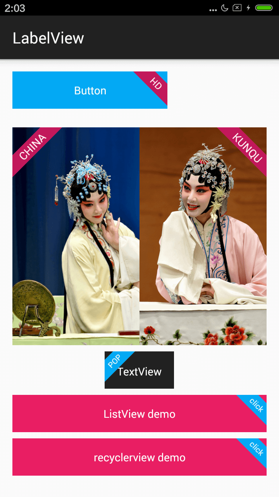
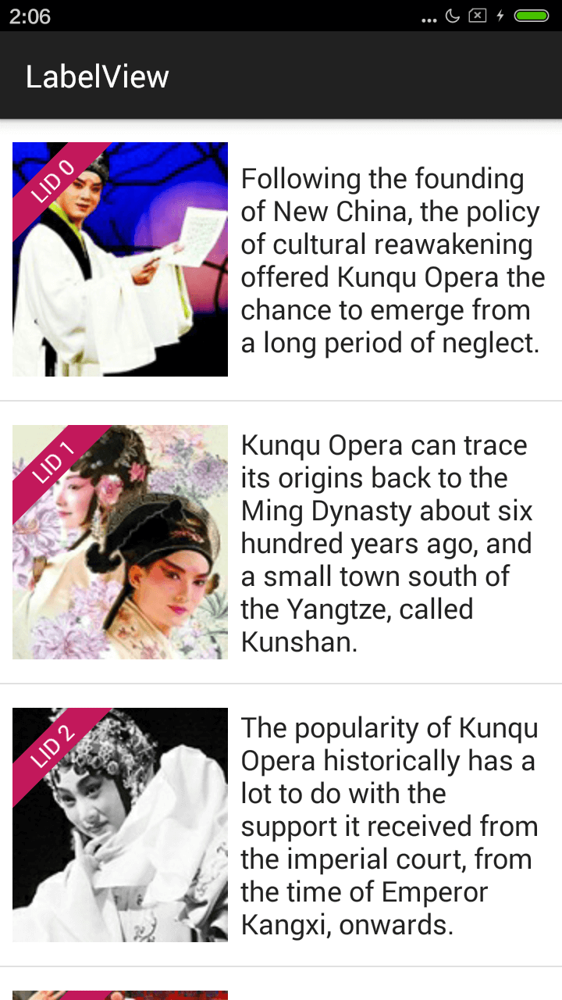
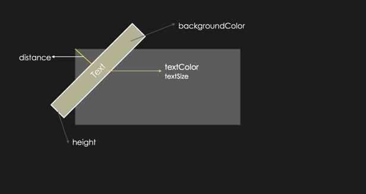

# LabelView
* 欢迎关注微信公众号、长期为您推荐优秀博文、开源项目、视频

* 微信公众号名称：Android干货程序员

* 

* 项目总贴:https://github.com/open-android/Android






### 第一步：在项目的根目录添build.gradle添加如下代码：

```
allprojects {
	repositories {
		...
		maven { url "https://jitpack.io" }
	}
}
```

<br />

### 第二步：在项目build.gradle文件添加依赖

```
dependencies {
	compile 'com.github.open-android:labelview:0.1.0'
}
```

<br />


## 给Button添加标签(展示出来就是上面蓝色按钮效果)

```java
<com.lid.lib.LabelButtonView
    android:id="@+id/labelbutton"
    android:layout_width="200dp"
    android:layout_height="48dp"
    android:background="#03a9f4"
    android:gravity="center"
    android:text="Button"
    android:textColor="#ffffff"
    app:label_backgroundColor="#C2185B"
    app:label_distance="20dp"
    app:label_height="20dp"
    app:label_orientation="RIGHT_TOP"
    app:label_text="HD"
    app:label_textSize="12sp"
    app:label_textStyle="BOLD"/>
```


## 给ImageView添加标签(展示出来就是上面左边图片效果)


```
<com.lid.lib.LabelImageView
                android:id="@+id/image1"
                android:layout_width="0dp"
                android:layout_height="match_parent"
                android:layout_weight="1"
                android:scaleType="centerCrop"
                android:src="@mipmap/image1"
                app:label_backgroundColor="#C2185B"
                app:label_orientation="LEFT_TOP"
                app:label_text="CHINA"
                app:label_textStyle="ITALIC"/>
```

* 如果想展示出来是上面图片右边效果修改属性
```
app:label_orientation="RIGHT_TOP"
```


### 给TextView添加标签(展示出来就是上面文本效果)


```
<com.lid.lib.LabelTextView
    android:id="@+id/text"
    android:layout_width="wrap_content"
    android:layout_height="48dp"
    android:layout_gravity="center"
    android:layout_marginTop="8dp"
    android:background="#212121"
    android:gravity="center"
    android:padding="16dp"
    android:text="TextView"
    android:textColor="#ffffff"
    app:label_backgroundColor="#03A9F4"
    app:label_distance="15dp"
    app:label_orientation="LEFT_TOP"
    app:label_text="POP"
    app:label_textSize="10sp"
    app:label_textStyle="BOLD_ITALIC"/>
```

### 给RecyclerView或者ListView添加标签(展示出来就是第二张图片效果)

跟普通的RecyclerView和ListView用法一模一样,就不贴代码了。

## 自定义标签，代码如下




1. create an new view class extends `YourView`
2. use LabelViewHelper as your `Member objects`
3. In Constructor function and onDraw function call LabelViewHelper method.
4. Call the LabelViewHelper method in other functions

like as follows:

```java
public class LabelXXXView extends YourView {
    LabelViewHelper utils;
    public LabelXXXView(Context context) {
        this(context, null);
    }
    public LabelXXXView(Context context, AttributeSet attrs) {
        this(context, attrs, 0);
    }
    public LabelXXXView(Context context, AttributeSet attrs, int defStyleAttr) {
        super(context, attrs, defStyleAttr);
        utils = new LabelViewHelper(context, attrs, defStyleAttr);
    }
    @Override
    protected void onDraw(Canvas canvas) {
        super.onDraw(canvas);
        utils.onDraw(canvas, getMeasuredWidth(), getMeasuredHeight());
    }
    public void setLabelHeight(int height) {
        utils.setLabelHeight(this, height);
    }
    public int getLabelHeight() {
        return utils.getLabelHeight();
    }
    public void setLabelDistance(int distance) {
        utils.setLabelDistance(this, distance);
    }
    public int getLabelDistance() {
        return utils.getLabelDistance();
    }
    public boolean isLabelVisual() {
        return utils.isLabelVisual();
    }
    public void setLabelVisual(boolean enable) {
        utils.setLabelVisual(this, enable);
    }
    public int getLabelOrientation() {
        return utils.getLabelOrientation();
    }
    public void setLabelOrientation(int orientation) {
      	utils.setLabelOrientation(this, orientation);
    }
    public int getLabelTextColor() {
        return utils.getLabelTextColor();
    }
    public void setLabelTextColor(int textColor) {
        utils.setLabelTextColor(this, textColor);
    }
    public int getLabelBackgroundColor() {
        return utils.getLabelBackgroundColor();
    }
    public void setLabelBackgroundColor(int backgroundColor) {
      	utils.setLabelBackgroundColor(this, backgroundColor);
    }
    public String getLabelText() {
        return utils.getLabelText();
    }
    public void setLabelText(String text) {
        utils.setLabelText(this, text);
    }
    public int getLabelTextSize() {
        return utils.getLabelTextSize();
    }
    public void setLabelTextSize(int textSize) {
        utils.setLabelTextSize(this, textSize);
    }
}
```
